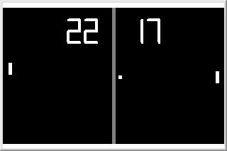



## Pong Clock

### Description

Watch the computer play Pong and score the time! Both sides are controlled by the computer but the right side seems to score 60 times more often... go figure! (update: fixed a few graphical issues)
 
### More Info
 

             |
---                |---
**Submitted On**   |2005-12-25 13:34:40
**By**             |[Paul Bahlawan](https://github.com/Planet-Source-Code/PSCIndex/blob/master/ByAuthor/paul-bahlawan.md)
**Level**          |Beginner
**User Rating**    |4.9 (34 globes from 7 users)
**Compatibility**  |VB 6\.0
**Category**       |[Miscellaneous](https://github.com/Planet-Source-Code/PSCIndex/blob/master/ByCategory/miscellaneous__1-1.md)
**World**          |[Visual Basic](https://github.com/Planet-Source-Code/PSCIndex/blob/master/ByWorld/visual-basic.md)
**Archive File**   |[Pong\_Clock19598112252005\.zip](https://github.com/Planet-Source-Code/paul-bahlawan-pong-clock__1-63650/archive/master.zip)

